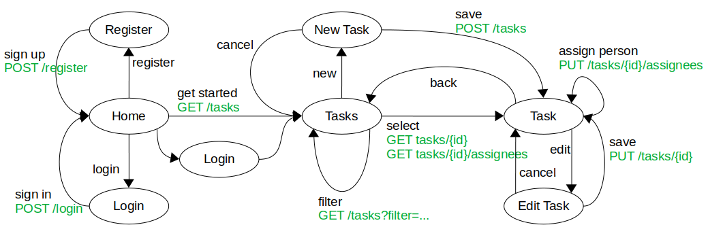

# Task Tracker Application

This project implements the frontend of my task's tracker system. The web-based frontend communicates
with the [Task Tracker Backend](https://github.com/tomwey2/task-tracker-backend-rest-spring-mongodb) via
REST api.

## Usage

Run the application:

    npm start

This command runs the application in the development mode. Open [http://localhost:3000](http://localhost:3000) to view it in your browser.

Run the application tests:

    npm test

Launches the test runner in the interactive watch mode.\
See the section about [running tests](https://facebook.github.io/create-react-app/docs/running-tests) for more information.

Build the application for deployment:

    npm run build

Builds the app for production to the `build` folder.\
It correctly bundles React in production mode and optimizes the build for the best performance.
See the section about [deployment](https://facebook.github.io/create-react-app/docs/deployment) for more information.

## Application model
The following picture shows the model of the application.

## Information about the used frameworks
Further information you can find at:
- [React documentation](https://reactjs.org/).
- [Create React App documentation](https://facebook.github.io/create-react-app/docs/getting-started).
- [Making a progressive web app](https://facebook.github.io/create-react-app/docs/making-a-progressive-web-app)
- [Advanced configuration](https://facebook.github.io/create-react-app/docs/advanced-configuration)
-[Deployment](https://facebook.github.io/create-react-app/docs/deployment)
- [Bootstrap 5](https://getbootstrap.com/)
- [React Bootstrap](https://react-bootstrap.github.io/)
- [Axios HTTP Client](https://github.com/axios/axios)
- [React-Router-Dom](https://github.com/remix-run/react-router)
